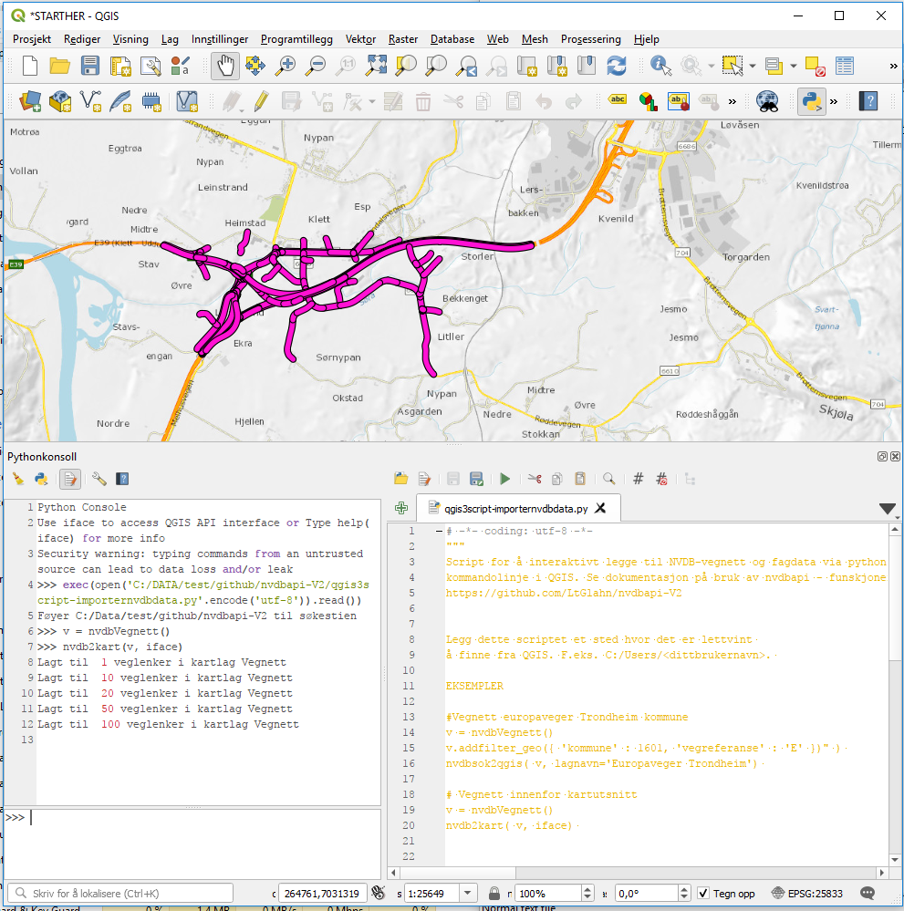
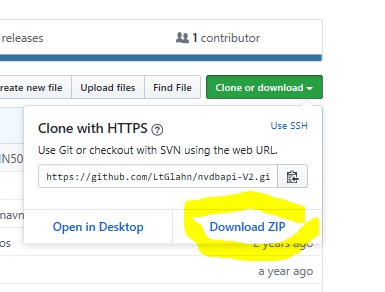
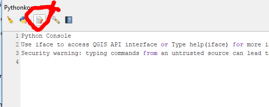
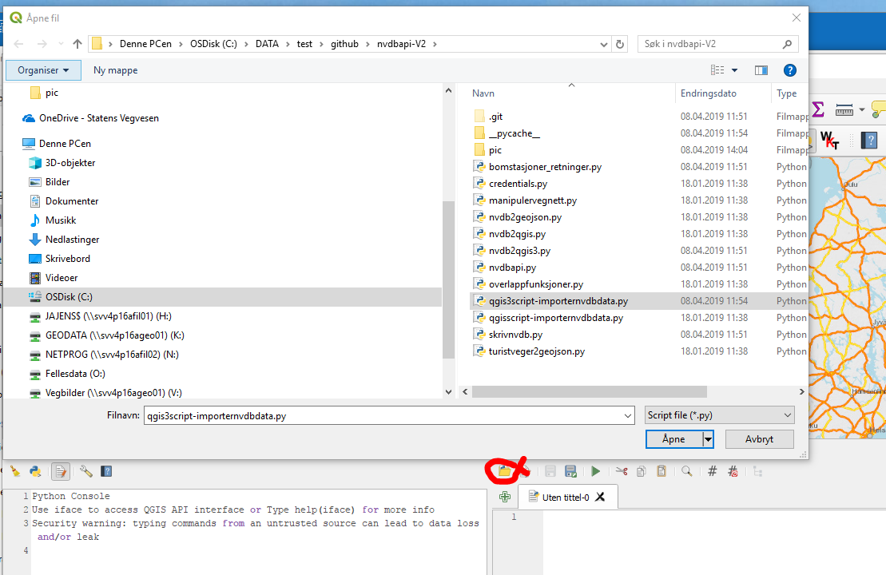
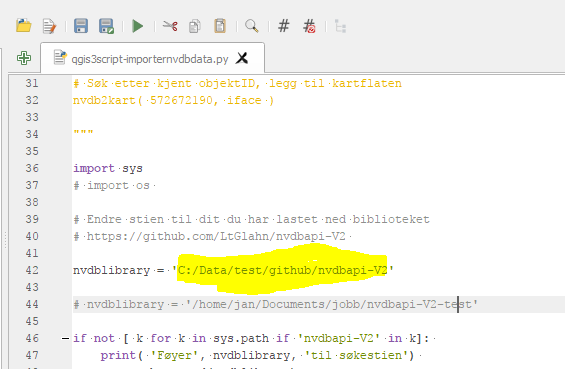
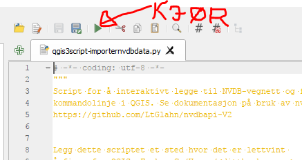

# Les NVDB-data inn i Qgis med kommandoline 

Dette er ikke en grafisk plugin, men et kommandolinjeverktøy hvor du henter 
NVDB data til QGIS med Python-konsollet. Søk, filtrering og nedlasting gjøres med såkalte "søkeobjekter" fra [https://github.com/LtGlahn/nvdbapi-V3](https://github.com/LtGlahn/nvdbapi-V3) (klassene _nvdbVegnett_ eller _nvdbFagdata_). 



### Eksempel - bomstasjoner i Oslo til Qgis 3
Innlesning gjøres i python-konsoll med kommandoen 

```
sokeobj = nvdbFagdata(45) 
sokeobj.filter( {'kommune' : 301 }) # Oslo kommune 
nvdbsok2qgis( sokeobj) 
```

Hvis man vil avgrense søket til kartflaten så bruker man i stedet
```
nvdb2kart( sokeobj, iface) 
```
iface er Qgis sin referanse til kartflaten, og må oppgis for at python-koden skal kunne finne kartflatens hjørnekoordinater. 

### Eksempel - hent NVDB objekt med ID

```
nvdb2kart( 85751392, iface) 
```

### Eksempel - hent veglenke med ID

```
nvdb2kart( 498976, iface, kunvegnett=True)
```


## Et par tips

Kommandoene og parametrene for qgis2 [les her](./qgisscript-importernvdbdata.py) og qgis3 (dette dokumentet) ligner, men er ikke identiske. 


#### Hvordan blir jeg god på filtre? 

Du leser dokumentasjon for nvdbFagObjekt i [nvdbapi-V3.py](./README.md) sammen med [dokumentasjon NVDB api](https://nvdbapiles-v3.atlas.vegvesen.no/dokumentasjon/) og [datakatalogen](https://datakatalogen.vegdata.no/).  Et par eksempler: 


```
# Bomstasjon
sokeobjekt = nvdbFagdata(45) 

# Dictionary med lokasjonsfiltre
sokeobjekt.filter( {'kommune' : 5001 })

# Tekststreng med egenskapfiltre
# Her wildkard-søk etter bomstasjoner med navn som begynner på "Nedre Leirfoss"
sokeobjekt.filter( { 'egenskap' : '1078="Nedre Leirfoss*"')) 
``` 

#### Hvilke filter er aktive, og hvordan nullstilles de?

Her finner du alle filtre: 
```
sokeobjekt.filter()         # Returnerer hvilke filter-verdier som er aktive 
```
Filtrene nullstilles ved å sende inn en tomt dictionary-objekt eller en tom tekststreng
```
sokeobjekt.filter({}) 
``` 


#### Søkeobjektet påvirkes når du føyer det til QGIS

Når du har kjørt kommandoene
```
sokeobjekt = nvdbFagdata(105) # Fartsgrense
nvdb2kart(sokeobjekt, iface)  # Fartsgrense lagt til kartflaten
```
så påvirker det tilstanden til søkeobjektet på to måter: 

  1. Paginering settes til tilstanden "har hentet alle objekter". 
  2. Du har påført filteret ´kartutsnitt=\<utsnittet til din QGIS-kartflate\>' 

Kommandoen nvdbsok2qgis påvirker paginering, men ikke geofilter. Pagineringstilstanden  kan du endre via kommandoen 
```
sokeobjekt.refresh()
```

Kartutsnittet vil bli oppdatert med nye verdier neste gang du kjører ´nvdb2kart´(sokeobjekt, iface)´. Men hvis du så bruker ´nvdbsok2qgis´ så vil resultatet fremdeles være avgrenset med det kartutsnittet du hadde sist gang du kjørte ´nvdb2kart´. 

## Installasjon 

  0. Lag et QGIS-prosjekt med CRS=5973 eller CRS=25833. (UTM sone 33, som er det [koordinatsystemet](https://www.vegdata.no/2020/03/11/nytt-referansesystem-nvdb/) vi bruker). 
  1. Last ned kildekoden [https://github.com/LtGlahn/nvdbapi-V3](https://github.com/LtGlahn/nvdbapi-V3). 
    * Er du ukjent med Github så let etter den grønne knappen "Clone or download". Da kan du laste ned en zip-fil som du pakker ut lokalt på din maskin
  2.  I Qgis: Programtillegg -> Start Python konsoll
  3. I python konsoll: Vis redigeringsmodul
  4. Åpne script. Naviger til filene du pakket ut i steg 1, og åpne fila: 
    * Qgis 3: **qgis3script-importernvdbdata.py**
	* _Qgis 2: qgisscript-importernvdbdata.py_
  5. Rediger søkestien i skriptet! Variabelen `nvdblibrary` må ha korrekt sti til mappen der du lagret kildekoden i steg 1. Lagre **Pro-tip:** _Lagre scriptet med et annet navn, eller i en annen mappe. Da kan du laste ned oppdateringer av nvdbapi-V2 uten å miste dine lokale innstillinger._ 
  6. Trykk den grønne "Kjør" - knappen
  7. Nå er du klar til å jobbe interaktivt i python-konsollet!
  
  
## Installasjon med bilder 

##### 0. Lag nytt QGIS-prosjekt med CRS=25833

Dette finner du selv ut av... 

##### 1. Last ned kildekoden

https://github.com/LtGlahn/nvdbapi-V3](https://github.com/LtGlahn/nvdbapi-V3). 
Er du ukjent med Github så let etter den grønne knappen "Clone or download". Da kan du laste ned en zip-fil som du pakker ut lokalt på din maskin



##### 2. Start Qgis python konsoll


Programtillegg -> Start python konsoll

##### 3. Start redigeringsmodul



##### 4. Åpne script 

Naviger til filene du pakket ut i steg 1, og åpne fila: 
  * Qgis 3: **qgis3script-importernvdbdata.py**
  * _Qgis 2: qgisscript-importernvdbdata.py_
  
 

##### 5. Rediger søkestien

Variabelen nvdblibrary må ha korrekt sti til mappen der du lagret kildekoden i steg 1.  **Pro-tip:** _Lagre scriptet med et annet navn, eller i en annen mappe. Da kan du laste ned oppdateringer av nvdbapi-V2 uten å miste dine lokale innstillinger._ 



##### 6. Kjør! Klart! 

Trykk den grønne "kjør"-knappen over editorvinduet, og du er klar til å jobbe interaktivt mot NVDB api og Qgis kartflate! 


