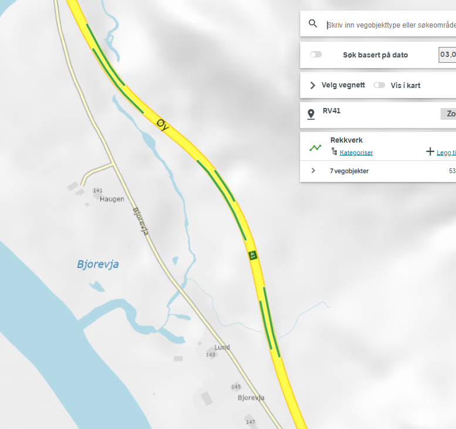

# Python, pandas, geopandas og shapely 

Python er ett av verdens mest brukte programmeringsspråk innenfor dataanalyse og databearbeiding. 
Via [shapely](https://shapely.readthedocs.io)-biblioteket og [geopandas](https://geopandas.org) er også både python og det svært populære [pandas](https://pandas.pydata.org)-biblioteket i stand til å støtte
geografiske operasjoner. De grunnleggende operasjonene er godt støttet, men du har ikke like 
avanserte muligheter som i desktop GIS (som f.eks FME). Men man kommer veldig langt med de grunnleggende operasjonene. 

Pandas / geopandas tilbyr en ekstremt kraftig "regneark-aktig" behandling av tabulære data. Dette har i årevis vært blant mine favorittverktøy, men jeg har savnet (manglet) funksjon for å finne overlapp langs vegnettet. 


# Overlapp langs vegnettet

NVDB har tre - 3 - parametre som beskriver posisjon og utbredelse langs vegnettet: 

  * Lineære posisjoner langs veglenkesekvens
  * Geografiske koordinater _i dette tilfellet langs vegnettet, dvs ikke s.k. egengeometri_. 
  * Vegsystemreferanse med meterverdier 

Alle tre systemene kan brukes til å finne overlapp og manglende overlapp mellom to NVDB datasett. Utfordringen er 
å lage metoder der resultatet blir riktig for _alle tre parametrene samtidig_, og aller helst uten å måtte supplere med ytterligere oppslag mot NVDB LES api. 

**Gullstandarden er selvsagt å finne overlapp basert på veglenkeposisjoner**, og det er den metoden vi bruker her. Posisjon
på veglenke oppgis alltid med 8 desimaler etter komma, noe som tilsvarer 0.1mm hvis veglenkesekvensen er 10km lang. Og 
omsider har vi utviklet metoder der vi også får riktig geometri og vegreferanseverdier. 

**Geografiske koordinater** kan selvsagt brukes, det er massevis av standard funksjonalitet i GIS verktøy som kan brukes til å 
manipulere geometri ut fra romlige relasjoner, inklusive `geopandas` og `shapely` - bibliotekene. Men hvis du også ønsker riktige veglenkeposisjoner og vegsystemreferanser må du som regel hente dem i etterkant fra NVDB api LES. 

**Vegsystemreferansen** er den mest upresise av de tre (nærmeste hele meter), 
og den er i tillegg ferskvare: Vegreferanser kan og vil 
endre verdi i takt med at vegnettet utvikler seg. Når det er sagt - analyser basert på hele meter fra vegsystemreferansen 
funker greit innafor sin "hele meter" presisjon såfremt datasettene har samme tidsstempel 
(evt at man har stålkontroll på at vegsystemreferansen ikke har endret seg mellom datauttakene). **Antagelsen om at 
vegreferansesystemet ikke endres har skapt utrolig mye kluss opp igjennom for utallige analyser og sammenstillinger.** 
For en del analyser er det også uheldig at alle resultater blir avrundet til hele meter. Og hvis du vil ha geometri og veglenkeposisjoner er du også her tvunget til å hente informasjon fra LES i etterkant. 

# Metodeutvikling og utfordringer

En utfordring med NVDB veglenkesekvenser er at vi ikke har _*hele*_ veglenkesekvensen tilgjengelig som 
en sammenhengende bit (LinesString) 
som starter med posisjon 0 og slutter i posisjon 1. Litt av grunnen er at noen av veglenkene langs en 
veglenkesekvens kan være tatt ut av bruk (satt historisk). 
Joda, det kunne la seg gjøre å rekonstruere den orginale veglenkesekvensen ut fra historiske data, men det er plundrete. Med hele veglenkesekvensen (0-1) representert som en sammenhengde LineString-geometri ville vi vært mer robuste 
mot numerisk unøyaktighet når vi skal "klippe" geometrien i en vilkårlig veglenkeposisjon. 

Jobben ville vært enklere hvis LES kunne gitt oss 
koordinater med _measure_ verdier - `LineString(x0 y0 z0 M0, x1 y1 z1 M1, ...)`, der den fjerde verdien `M` angir hvilken veglenkeposisjon som gjelder for de geografiske koordinatene `(x,y,z)`. I så fall 
er det jo grei sak å interpolere mellom de to koordinatpunktene med M-verdi nærmest inntil den ønskede veglenkeposisjonen.  

Innafor disse begrensingene så var det magert utvalg med metoder for manipulering av lineære 
referanser og geometri i de pythonbibliotekene jeg sjekket. Jeg 
prøvde først en metode der vi laget en lineær funksjon for forholdet mellom fysiske meter 
og de veglenkeposisjonene vi har i start og slutt av segmentet vårt: 
```python
# Lengde i meter y= f(x) = a*x som funksjon av veglenkeposisjon x langs dette segmentet
# der x er innafor intervallet [startposisjon, sluttposisjon ]
a = mygeom.length / (sluttposisjon -  startposisjon)
L = a * nyposisjon 
# startposisjon <= nyposisjon <= sluttposisjon 
# Avstanden L kan nå brukes til å klippe geometrien nygeom med vår egenskrevne funksjon shapelycut, 
# som klipper geometrier i to i et punkt L meter fra starten  
```

Metoden fungerte, men ble altfor upresist: Geometrien vår kan være mellom 1m og flere titalls kilometer 
(teoretisk), og denne lengden skal så deles på en differanse i veglenkeposisjon som kan være ørliten. 
Dette er et uheldig delestykke, rent numerisk, og resultatet ble uakseptabelt upresist. 

> I stedet så bruker vi det faktum at vi IKKE skal ikke "klippe" geometrien i en vilkårlig posisjon: 
> Vår metode skal "klippe" slik at vår overlapp (og de bitene som ikke overlapper) stemmer eksakt med
> utstrekningen til inngangsdataene.  Vår "klipping" vil derfor alltid skje eksakt på start eller slutt
> i ett av ett av segmentene i inngangsdataene. Alt vi trenger gjøre er å ta vare på og utnytte denne 
> informasjonen, så unngår vi den upresise omregningen over. 

Så dermed lager vi en oppslagsnøkkel (dictionary) mellom veglenkeposisjon og geografiske punkt for 
start og slutt på alle segmenter langs en veglenkesekvens. 

```python
# Anta at data = liste med (shapely-LineString-geometri, startposisjon, sluttposisjon) langs samme veglenkesekvens
# Vi aner foreløpig ikke hvor vi skal "klippe", men tar vare på informasjon om hvilket 
# koordinat som gjelder for hver eneste start- og sluttposisjon 

from shapely import Point 
geomPunktVpos = { }
for myLine in data:              # data = [(mygeom0, start0, slutt0), (mygeom1, start1, slutt1), ... ]
    mygeom        = myLine[0]    # mygeom=Shapely LineString - objekt
    startposisjon = myLine[1]
    sluttposisjon = myLine[2] 
    geomPunktVpos[startposisjon] = Point( mygeom.coords[0] ) # Lager Shapely punkt-geometri objekt
    geomPunktVpos[sluttposisjon] = Point( mygeom.coords[1] ) # Lager Shapely punkt-geometri objekt

# Nå har vi en oppslagsnøkkel mellom alle potensielle "klippepunkter" og tilhørende geometrisk punkt (shapely)
# Via litt finregning finner vi de veglenkeposisjoner som gir oss overlapp og anti-overlapp ("til overs", left join)
# Så nå kan vi sende en presis geografisk posisjon til vår modifiserte shapelycut - funksjon.
```

Tilsvarende metode brukes også for å få riktig meterverdi på vegsystemreferansen: Vi lager oppslagsnøkkel (dictionary) mellom veglenkeposisjon og hele meter, og bruker denne for å sikre at vi får rett meter i sluttresultatet 

# Hvorfor har vi en egen funksjon `shapelycut` ?

Denne funksjonen er (underlig nok) ikke implementert som en del av shapely-biblioteket, men 
er godt beskrevet i shapely-dokumentasjonen
https://shapely.readthedocs.io/en/stable/manual.html#linear-referencing-methods 
Vår implementasjon `shapelycut` er tilpasset til å håndtere både 2D `(x,y)` og 3D `(x,y,z)` koordinater.

# Segmentering 

En `left join` mellom f.eks vegnettet eller en heldekkende objekttype (f.eks fartsgrense eller  bruksklasse normal- eller tømmertransport) og en annen NVDB objekttype (eller hva som helst annet som har utstrekning langs vegnettet beskrevet med posisjoner langs veglenkesekvens ID) kan sees på som en _segmentering_ av to datasett. Sluttresultatet kan så inngå i en ny _left join_ med et tredje datasett, så et fjerde og så videre. Dermed oppnår man mye av det samme som en fullblods segmenteringsprosess. 

Ett viktig forbehold: Hvis det kan finnes mer enn én objektforekomst samme sted langs vegnettet så vil du få mer enn én rad i sluttresultatet. For eksempel hvis du tar en left join av fartsgrense pluss rekkverk langs [denne delen av Rv41](https://vegkart.atlas.vegvesen.no/#kartlag:geodata/@129236,6547560,15/hva:!(id~5)~) så får du to rader med fartsgrense+rekkverksdata det finnes rekkverk på begge sider, én per rekkverk-objekt. Der det ikke finnes rekkverk overhodet så vil `left join` gi deg data om fartsgrense, men mangle dataverdier for rekkverk. 

 

En skikkelig segmenteringsprosess vil ta hensyn til at det finnes mer enn étt rekkverk og gi deg et sluttresultatene der de to rekkverkene er blandet sammen til én rad i datasettet. Da må selvsagt segmenteringsprosessen 
ha regler for hvordan to (evt flere) rekkverk skal blandes sammen til én ferdig rad (f.eks gjennomsnitt, viktigste, evt ramse opp begge rekkverkenes dataverdier, lage lister eller noe helt annet).  
