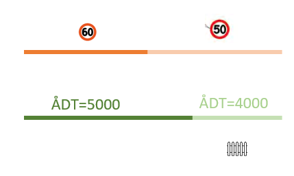
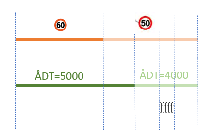
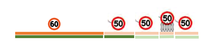
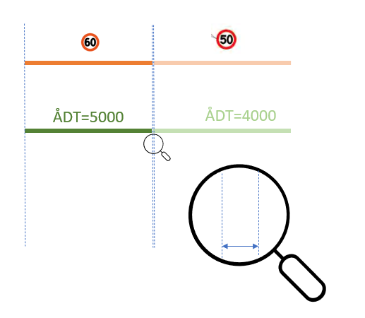

# Segmentering 

For oss NVDB-nerder betyr _segmentering_ kunsten å lage et pent og ryddig vegnettsdatasett utav et mangfoldig datagrunnlag der dataene har ulik utstrekning langs vegnettet. Figuren under viser et eksempel på hvordan det kan se ut: Vi har en vegstrekning der vi har data for fartsgrense og trafikkmengde (ÅDT) - og en bit av strekningen har også et gjerde. 



En segmenteringsprosess vil først "klippe opp" datasett basert på alle start- og sluttpunkt som finnes i de ulike datasettene:



Og de "oppklippede" bitene kan så settes sammen til små segmenter.  



I  eksemplet vårt startet vi med en sammenhengende bit for vegnettet pluss to fartsgrenser, to trafikkmengde-objekter og ett gjerde - og sluttresultatet blir fem segmenter (korte biter). Hver eneste av disse bitene har nå informasjon om vegnettet, trafikkmengde, fartsgrense og gjerder (selv gjerdet kun finnes på én av bitene så vil de fire andre bitene ha informasjon om at det IKKE finnes gjerder på strekningen). 

# Våre inngangsdata

Metoden `segmentering.py` jobber med strekningsdata, det vil si data som har en utstrekning langs vegnettet, ikke data som kun er stedfestet i et punkt på vegnettet _(slike data kan du enkelt stedfeste på segmenteringsresultatet etterpå, her kommer det sikkert noen kodeeksempler etter hvert)_. 

Som inngangsdata bruker vi [geoddataframes](https://geopandas.org)  slik de blir laget av [nvdbapiv3](https://github.com/LtGlahn/nvdbapi-V3) - biblioteket, som igjen henter såkalt "segmentert vegnett" og segmenterte fagdata fra [NVDB api LES](https://nvdbapiles-v3.atlas.vegvesen.no/dokumentasjon). Segmentering i NVDB api LES betyr at NVDB-data blir segmentert på kontraktsområde, kommune, vegsystemreferanse, riksvegrute (og et par andre ting). Dette har noen fordeler, blant annet at hvert segment i inngangsdataene er pent strukturert og har 1:1 forhold mellom geometri, vegsystemreferanse og lineære posisjoner. 

Vår rutine bruker lineære posisjoner på veglenkesekvens til å regne ut bruddpunkter og sette dem sammen til små segmenter. Vi legger vekt på at sluttresultatet skal være samsvar mellom geometri (koordinater) og lineær utstrekning, og med riktig vegreferanse med meterverdi (såfremt kolonnen `vref` finnes i inngangsdataene). Inngangsdata kan selvsagt komme fra en annen kilde enn NVDB såfremt du har koblet data til NVDB vegnett og du må ha følgende egenskaper (kolonner): 

| Egenskapsnavn | Innhold | 
|:---------------|:--------|
| veglenkesekvensid |  Id til NVDB veglenkesekvens |
| startposisjon | Flyttall med 8 desimalers presisjon, starten på utbredelsen langs veglenkesekvensid | 
| sluttposisjon | Flyttall med 8 desimalers presisjon, starten på utbredelsen langs veglenkesekvensid | 
| geometry | [shapely](https://shapely.readthedocs.io/) LineString geometrisk objekt |
| vref | _**Kan sløyfes**_, tekststreng med vegsystemreferanse på formatet `RV2 S2D1 m300-1200` | 

Øvrige egenskapsnavn vil bli videreført til analysen (parameter `glemNvdbDetaljer=True` vil ignorere en del typiske NVDB-egenskaper som sjelden tilfører verdi, slik som _Prosjektreferanse, Eier_ etc). Men som hovedregel er det lurt at du kun sender inn de dataverdiene som har relevans, dvs dem som er angitt over pluss de egenskapene du ønsker å ha i sluttresultatet. Tilsvarende er det ditt ansvar å sørge for at det ikke er navnekollisjon på egenskapsnavn blant datasettene som skal segmenteres. 

### Vegnett og fagdata

Første argument til `segmenter` - funksjonen er en [geodataframe](https://geopandas.org/) som representerer (et subsett av) vegnettet. Som regel vil vi bruke enten [segmentert vegnett fra NVDB api LES](https://nvdbapiles-v3.atlas.vegvesen.no/dokumentasjon/openapi/#/Vegnett/get_vegnett_veglenkesekvenser_segmentert), alternativt [ikke-segmenterte veglenker](https://nvdbapiles-v3.atlas.vegvesen.no/dokumentasjon/openapi/#/Vegnett/get_vegnett_veglenkesekvenser). Men du kan også bruke et annet datasett, for eksempel fartsgrenser fra NVDB. _(Vi har også ambisjoner om at du kan bruke et ruteforslag fra ruteplantjenesten som vegnettsdefinisjon, men dette må vi jobbe mere med.)_ Merk at vi kun håndterer vegsystemreferanser hvis egenskapen (kolonnen) `vref` finnes og er populert med gyldige verdier i vegnettsdataene. 

Andre argument er en liste med de datasettet som skal segmenteres med hensyn på vegnettet. Hvert element i listen er [geodataframe](https://geopandas.org/), typisk vegobjekter hentet fra NVDB api LES med `nvdbapiv3.nvdbFagdata(<objektTypeId>).to_records()` som så er videre bearbeidet til en GeoDataFrame.   

# Metodikk 

Vi har dårlig erfaring med å klippe geometri basert på flyttalsoperasjoner basert på forholdet mellom veglenkeposisjoner og geometrisk lengde: Det blir for upresist. I stedet utnytter vi at selve klippeprosessen jo baserer seg på presist definerte start- og sluttpunkt for de datasettene som inngår: 


Hvert "kuttpunkt" i dette steget av segmenteringsprosessen har en presist definert geometri lik eksakt første (eller siste) punkt på den linja som starter (evt slutter) i dette punktet på vegnettet. Via operasjonen på shapely-objektet `geometry.coords[0]` eller `geometry.coords[-1]` får vi tilgang til dette koordinatpunktet. Alt vi trenger å gjøre er å lagre informasjonen som en dictionary (oppslagstabell) for hver eneste veglenkeposisjon i datagrunnlaget: 

```python
from shapely import Point 
vpos = {} # Dictionary med geometri for veglenkeposisjoner
for enBitAv in inngangsdata: 
    vpos[ enBitAv['fraposisjon']] = Point( enBitAv['geometry'].coords[0] )
    vpos[ enBitAv['tilposisjon']] = Point( enBitAv['geometry'].coords[-1] )    
```

Dette geometriske punktet inngår så i "klippe"-operasjonene som vi gjør på vegnettsgeometrien (shapely LineString, med metoden `shapelycut` fra [github/LtGlahn/overlapp.py](https://github.com/LtGlahn/nvdbapi-V3/blob/master/overlapp.md#user-content-hvorfor-har-vi-en-egen-funksjon-shapelycut-) )

Samme logikk brukes for å holde styr på riktige meterverdier til vegsystemreferansen (gitt at kolonnen `vref` med vegsystemreferanser finnes i data for vegnettet): Vi lager en dictionary der vi kan gjøre oppslag på veglenkeposisjon (flyttall) og få riktig meterverdi. 

# Bitene blir for korte

Enhver segmenteringsprosess vil møte problemet med at to datasett _*nesten*_ har perfekt overlapp. Nedenfor er det illustret ved at fartsgrense endres fra 60 til 50 i _*nesten*_ samme punkt på vegnettet som der ÅDT-verdiene endres fra 5000 til 4000 kjt/døgn. Denne _*nesten perfekte*_ overlappen blir til et veldig kort segment - hvilket gir oss to problemener: 
  1. det er dårlig datakvalitet å ha veldig korte biter
  1. rent teknisk kan ultrakorte biter gi crash eller feilmelding i en del analyse- og kartprogramvare _(en variant er jo at ultrakorte linjestykker blir omgjort til punkt, men det kan gi trøbbel senere i analyseløpya)_.    



Vår håndtering av dette problemet består i at vi analyserer vår datastruktur med "kuttpunkt" (`vpos`-dictionary) og "hopper over" de kuttpunktene som ellers ville gitt  segmenter kortere enn parameter  `minsteLengde`, som har defaultverdi = 0.1, dvs 10cm. 

> Håndtering av minstelengde er den mest komplekse delen av vår kode, ca 80 kodelinjer som tygger seg gjennom alle mulige kuttpunkt med flere pekere (indekser) å holde styr på. 
>
> Disse indeksene representerer to segmenter: `arbeidssegment1` (som vi vet er lengre enn minstelengde fordi vi konstruerte den slik!) og `arbeissegment2` (som vi gjør gradvis større inntil den oppnår minstelengde). Når vi kommer dit at `arbeissegment2 > minsteLengde` så lagrer vi kuttpunktene som definerer `arbeidssegment1`, setter `arbeidssegment1 = arbeidssegment2` og starter på et nytt `arbeidssegment2`. Gjenta inntil vi når enden av den vegnettsbiten vi itererer over.  Pluss litt logikk som sikrer at vegnettsbiten ikke blir kortere hvis det er et mulig bruddpunkt helt i start eller slutt av vegnettsbiten. 

# Aggregering når det finnes flere objekt på samme sted 

Noen datasett (f.eks rekkverk) kan ha _intern overlapp_, det vil si at det kan finnes mer enn ett objekt på samme strekning. For eksempel et rekkverk på hver side av vegen. Vi trenger et regelverk for hvordan dette skal håndteres: Skal vi telle antall rekkverk? Skal vi legge sammen ulike dataverdier, eller ta en form for gjennomsnitt? Dette kan du detaljregulere via parameteren `agg={ 'dictonary' : 'med aggregeringsregler' }`, beskrevet mer i detalj i dokumentasjonen for `segmenter` i fila `segmentering.py`. Standard oppførsel hvis ikke annet er angit er å bruke data fra det første objektet vi tilfeldigvis møter på (aggregeringsregel `first`). 

# Få renere datasett: Homogenisering og generalisering 

Ofte er det ønskelig å etterbehandle resultatene, for eksempel ved å slå sammen korte biter som ligner på hverandre til litt færre og 
lengre biter. Regelverket for hva som `ligner på hverandre` kan fort bli komplekst. Vi har ikke laget noen slik rutine (ennå). 

# Snudd stedfesting i NVDB

Noe veldig få objekter i NVDB er stedfestet på vegnettet med retning = MOT. Disse må spesialhåndteres, fordi geometrien starter i det som er `sluttposisjon` på veglenkesekvens og har endepunkt i `startposisjon`. Det vil si stikk motsatt retning av alt annet. 

> Mye av slik stedfesting er nok gamle datafeil. Et par objekttyper, for eksempel _916 Strekning_, skal stedfestes på denne måten ved gitte betingelser (i tilfellet 916 så signaliserer retning=MOT at meterverdiene skal telles motsatt veg av lenkeretninga). Men for f.eks bruksklassedata på kommunalveg så gir det overhodet ingen mening med stedfesting MOT.  

Funksjonen `nvdbapiv3.nvdbfagdata().to_records()`  er nå modifisert slik at den legger på egenskapen `segmentretning=MOT` når den møter slike tilfeller. Hvis denne følger med i inngangsdataene så vil segmenteringsrutina ta hensyn til det, og bytte retning der det trengs. 

# Tidsbruk 

Segmentering av ERFK-vegnettet på bruksklasse-objektene _904 BK Normaltransport,  900 BK Tømmertransport_ og _889 BK Modulvogntog_ tar litt under 3 timer med python installert på WSL 1 på en såkalt "DAK-PC" med ganske greie spesifikasjoner (8 kjerner, 32GB RAM f.eks). Metoden
burde egne seg godt for parallellisering. 

Det er muligens også en del å hente på å utnytte at mye av dataene allerede er _ferdig segmentert_. Spesielt for data med (nesten) heldekkende utstrekning vil mye av datagrunnlaget ha _perfekt overlapp_. Grunnen er at vårt datagrunnlag er (i all hovedsak) såkalt _segmentert vegnett_ og fagdata i all hovedsak jo nettopp er segmentert på dette vegnettet (dette er standardinnstillingene til `nvdbapiv3` - biblioteket for søk etter vegnett `nvdbappiv3.nvdbVegnett()` og metoden `nvdbapiv3.nvdbFagdata().to_records()`. Man kunne derfor tenke seg en rutine som fant _perfekt overlapp_ via SQL eller dataframe - spørring (slik vi gjør i [overlapp](https://github.com/LtGlahn/nvdbapi-V3/blob/master/overlapp.md)). Den relativt trege prosessen med segmentering kan så gjøres på de radene uten perfekt overlapp. 